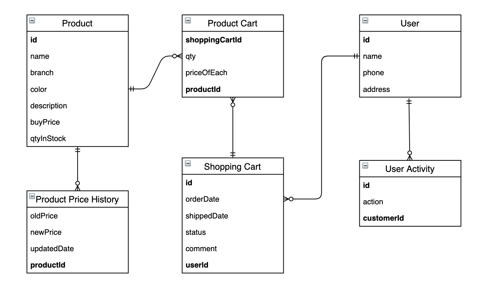
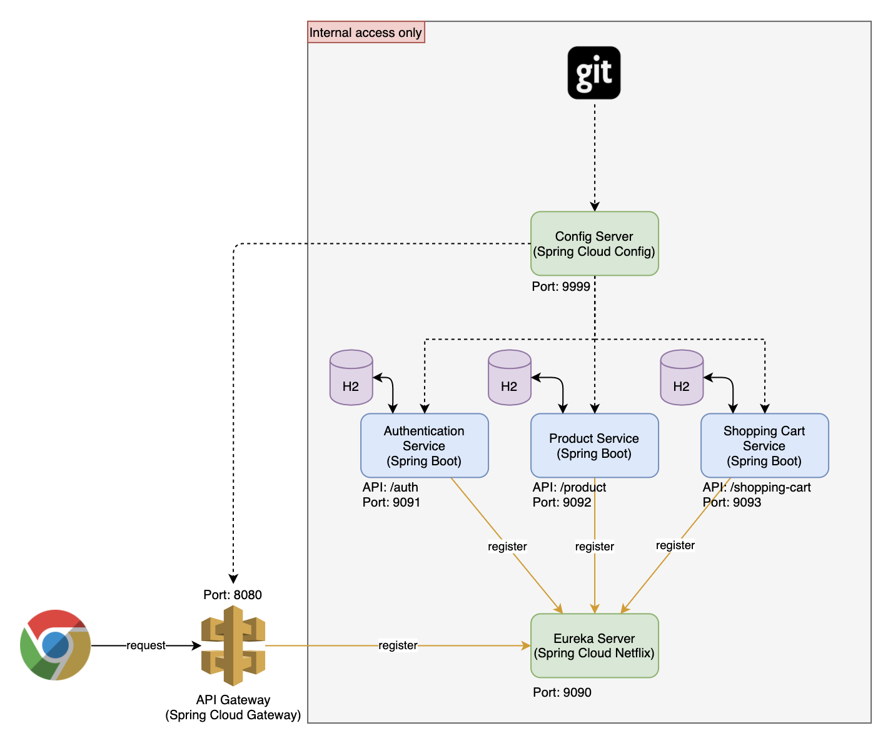
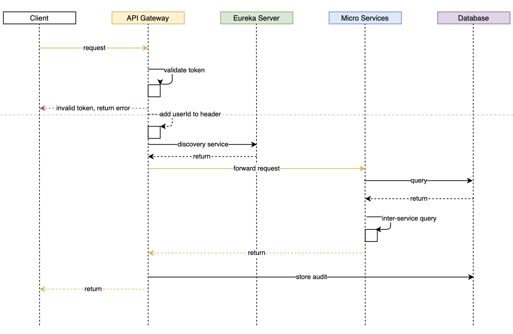

# iCommerce

An online shopping application to sell the products. <br>
User can search the products they wants and add to a shopping cart and proceed to place an order.<br>
To manage and make the users be satisfied, all the user activities related to the products such as finding, view detail information of a product will be stored, visualize and report so that the company will know which is the most likely products and the others.


### Table of Contents
**[Entity Relationship Diagram](#entity-relationship-diagram)**<br>
**[System Architecture](#system-architecture)**<br>
**[System Workflow](#system-workflow)**<br>
**[Configuration Repository](#configuration-repository)**<br>
**[Service Details](#service-details)**<br>
**[Main Workflow](#main-workflow)**<br>
**[How To Run](#how-to-run)**<br>
**[Generated Data](#generated-data)**<br>
**[CURL Commands](#curl-commands)**<br>
**[Improvements](#improvements)**<br>

## Entity Relationship Diagram


## System Architecture



## System Workflow


## Configuration Repository
To manage and share the configuration between the micro services, configuration repository is required for the entire system.
Link: [icommerce-config](https://github.com/hoangdieuctu/icommerce-config)

The repository contains the configuration of all services with 'default' profile.

Structure
```bash
apigateway-default.yml
application-default.yml
authenticationservice-default.yml
eurekaserver-default.yml
productservice-default.yml
shoppingcartservice-default.yml
```

## Service Details

### Authentication Service

#### Dependencies
#### Code folders

### Product Service

### Shopping Cart Service

### Api Gateway

### Config Server

### Eureka Server

## Main Workflow

## How To Run

### By Local Machine

### By Docker

## Generated Data
For testing purpose, when starting the services, there are some data is generated automatically.

### Products

## CURL Commands

## Improvements