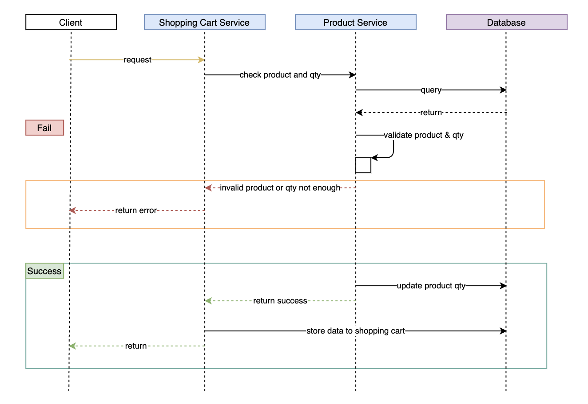

# Shopping Cart Service
The service manage the user shopping cart.
It's allow user view their cart and add more items to the cart.

## Work Flow
### Add an item to shopping cart


## Project Structure
```bash
├── Dockerfile
├── README.md
├── pom.xml
└── src
    ├── main
    │   ├── java
    │   │   └── com
    │   │       └── icommerce
    │   │           └── shoppingcartservice
    │   │               ├── ServerApplication.java
    │   │               ├── advice
    │   │               │   └── CustomExceptionHandler.java
    │   │               ├── controller
    │   │               │   └── ShoppingCartController.java
    │   │               ├── dto
    │   │               │   ├── request
    │   │               │   │   └── ProductRequest.java
    │   │               │   └── response
    │   │               │       ├── ErrorResponse.java
    │   │               │       └── ProductResponse.java
    │   │               ├── exception
    │   │               │   ├── DownstreamException.java
    │   │               │   └── ShoppingCartException.java
    │   │               ├── model
    │   │               │   ├── ProductCart.java
    │   │               │   ├── ShoppingCart.java
    │   │               │   └── ShoppingStatus.java
    │   │               ├── repository
    │   │               │   └── ShoppingCartRepository.java
    │   │               └── service
    │   │                   ├── ProductService.java
    │   │                   ├── ShoppingCartService.java
    │   │                   ├── downstream
    │   │                   │   └── ProductServiceImpl.java
    │   │                   └── impl
    │   │                       └── ShoppingCartServiceImpl.java
    │   └── resources
    │       ├── application.yml
    │       └── bootstrap.yml
    └── test
        └── java
            └── com
                └── icommerce
                    └── shoppingcartservice
                        ├── controller
                        │   └── ShoppingCartControllerTest.java
                        └── service
                            ├── ProductServiceTest.java
                            └── ShoppingCartServiceTest.java
```

## Dependencies
```
spring-cloud-starter-config
spring-cloud-starter-netflix-eureka-client
spring-cloud-starter-zipkin
spring-boot-starter-web
spring-boot-starter-data-jpa
```